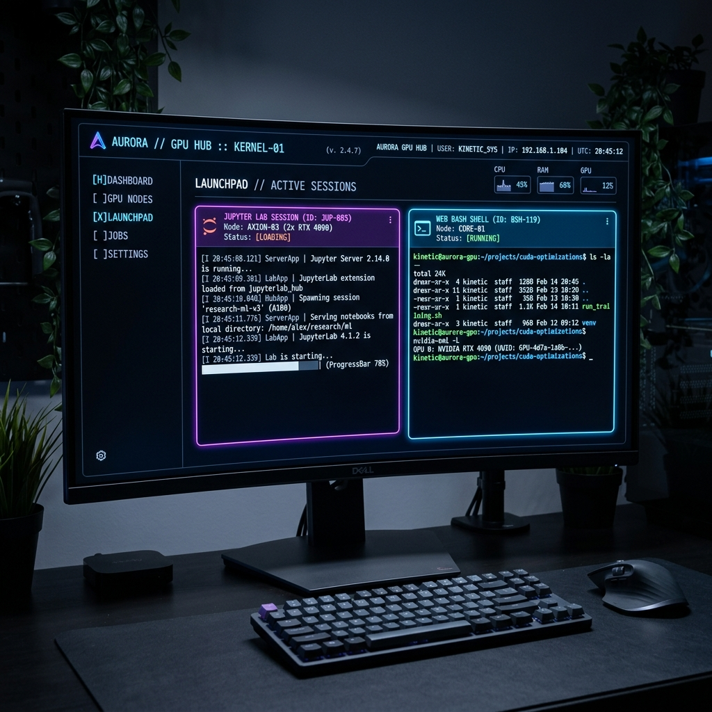
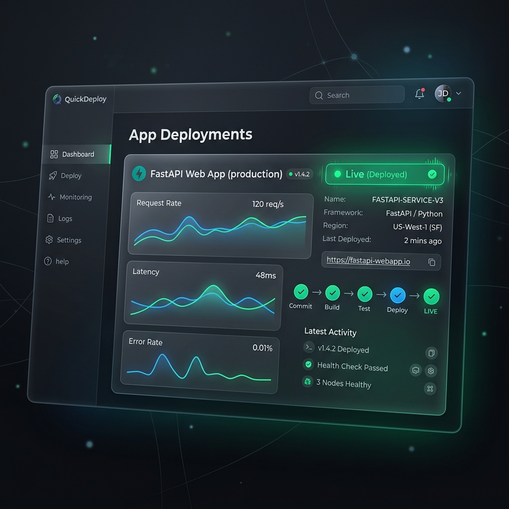
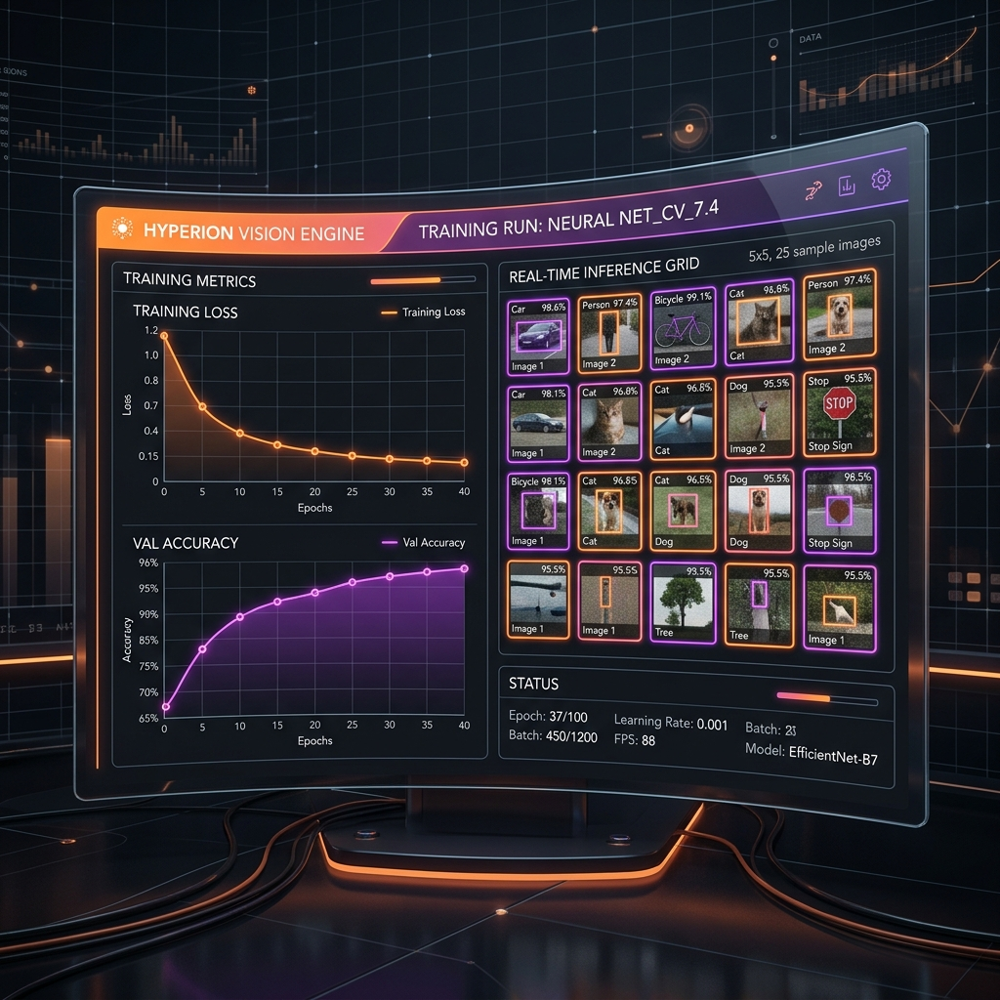
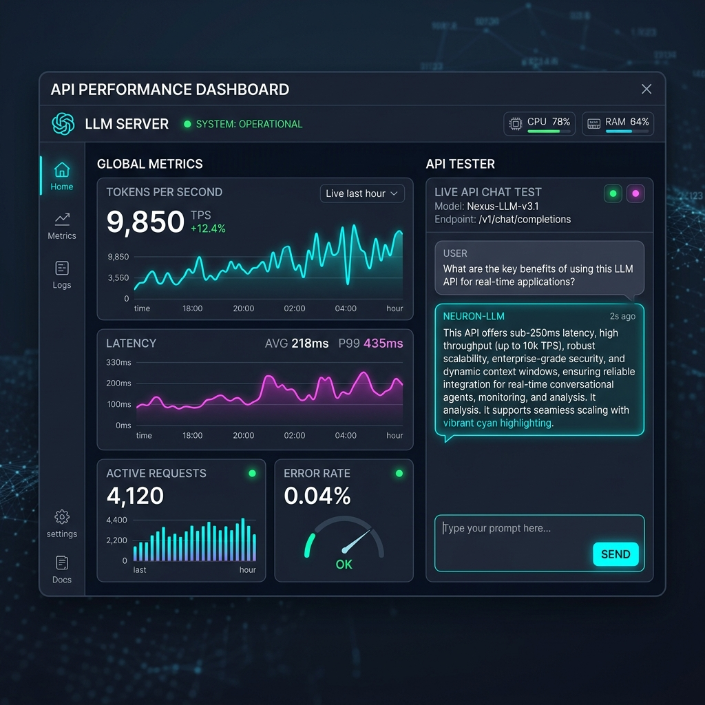

<div align="center">
  <h1>🚀 m-gpux</h1>
  <p><em>A professional CLI toolkit for Modal power users. Need fast GPU access, multi-profile account control, and simple cost visibility? Look no further.</em></p>

  <p>
    <a href="https://www.python.org/"></a>
    <a href="https://pypi.org/project/m-gpux/"></a>
    <a href="https://typer.tiangolo.com/"></a>
    <a href="https://puxhocdl.github.io/m-gpux/"></a>
    <a href="https://github.com/PuxHocDL/m-gpux/blob/main/LICENSE"></a>
  </p>
</div>

<hr/>

## ✨ Highlights

- **🧠 LLM API Server** - Deploy any HuggingFace model as an OpenAI-compatible endpoint with API key auth.
- **⚡ Interactive GPU Hub** - Spin up Jupyter, execute scripts, and establish web shell sessions instantly.
- **🌐 Web Hosting** - Deploy FastAPI / Flask / static sites as persistent URLs with auto-scaling.
- **🖼️ Vision Workflows** - Train and predict image classification models from local datasets with configurable model, GPU, and hyperparameters.
- **👥 Multi-Account Management** - Seamlessly manage multiple profiles in one unified command namespace.
- **💸 Unified Cost Visibility** - Inspect billing per profile or get a comprehensive view across all configured accounts.
- **🎨 Friendly Terminal UX** - Enjoy rich tables, intuitive prompts, and interactive guided flows right in your terminal.

## 📖 Table of Contents

- [Installation](#%EF%B8%8F-installation)
- [Quick Start](#-quick-start)
- [Core Commands](#%EF%B8%8F-core-commands)
  - [Profile Management](#-profile-management)
  - [Interactive Hub](#-interactive-hub)
  - [Web Hosting](#-web-hosting)
  - [Computer Vision](#%EF%B8%8F-computer-vision)
  - [LLM API Server](#-llm-api-server)
  - [Billing](#-billing)
- [Examples](#-examples)
- [Architecture](#%EF%B8%8F-architecture)
- [Troubleshooting](#-troubleshooting)
- [Contributing](#-contributing)

---

## ⚙️ Installation

### Prerequisites

- **Python**: 3.10 or higher.
- **Credentials**: Modal account credentials (`token_id`, `token_secret`).
- **Modal CLI**: Ensure the `modal` CLI is installed and in your PATH.

### PyPI (Recommended)
The fastest way to get started is by installing directly from PyPI.

```bash
pip install m-gpux
```

### From Source
Great for contributors or users who want the bleeding edge.

```bash
git clone https://github.com/PuxHocDL/m-gpux.git
cd m-gpux
pip install -e .
```

---

## 🚀 Quick Start

Get up and running in 6 easy steps:

```bash
# 1) Add your first profile
m-gpux account add

# 2) Check configured profiles
m-gpux account list

# 3) Launch the interactive GPU hub
m-gpux hub

# 4) Generate a tiny sample vision dataset, then train on it
m-gpux vision sample-data
m-gpux vision train --dataset ./data/m-gpux-vision-sample

# 5) Host a FastAPI app as a persistent URL
m-gpux host asgi --entry main:app

# 6) Deploy an LLM as an OpenAI-compatible API
m-gpux serve deploy

# 7) Inspect 30-day usage across all accounts
m-gpux billing usage --days 30 --all
```

---

## 🛠️ Core Commands

Whether you need to manage your accounts, deploy APIs, or check your billing, we've got you covered. Check out our global commands with `m-gpux --help` and `m-gpux info`.

### 👥 Profile Management
Seamlessly hop between different Modal environments.

```bash
m-gpux account list                    # View all active profiles
m-gpux account add                     # Interactively add a new profile
m-gpux account switch <profile_name>   # Switch active profile
m-gpux account remove <profile_name>   # Remove an existing profile
```
> **Note**: Modal profiles are safely persisted in `~/.modal.toml`. If the active profile is removed, another existing profile is automatically promoted.

### ⚡ Interactive Hub
Your control center for remote execution.

<p align="center">
  
</p>

```bash
m-gpux hub
```
The Bash Shell action now starts a VS Code-like direct `bash` session in the browser. It uses a clean prompt, reduced WebSocket heartbeat traffic, and keeps `tmux` available as an optional manual command when you need detachable sessions.

**Actions included:**
- 🪐 Launch Jupyter Lab on your selected GPU.
- 📜 Run local Python scripts natively on remote GPUs.
- 💻 Initiate an interactive web Bash shell session.

### 🌐 Web Hosting
Deploy web apps and static sites as persistent public URLs on Modal.

<p align="center">
  
</p>

```bash
m-gpux host asgi --entry main:app     # FastAPI / Starlette
m-gpux host wsgi --entry app:app      # Flask / Django
m-gpux host static --dir ./site       # HTML/CSS/JS folder
```

**Features:**
- Persistent URL that stays live until you `m-gpux stop`.
- Auto-scales to zero when idle (pay only for actual requests).
- Optional warm replicas (`min_containers`) for zero cold-start.
- GPU support for ML inference endpoints (e.g. FastAPI + PyTorch).
- Auto-detects `requirements.txt` and uploads your project folder.

### 🖼️ Computer Vision
Train and predict image classifiers on Modal GPUs directly from local folders.

<p align="center">
  
</p>

```bash
m-gpux vision sample-data
m-gpux vision train
m-gpux vision predict
```

**Workflow highlights:**
- Includes a tiny synthetic shape dataset for demos and can regenerate/customize it locally with no external downloads.
- Validates common dataset layouts such as `dataset/train/<class>` + `dataset/val/<class>` or a single root folder with class subdirectories.
- Lets you choose from many TorchVision models including ResNet, EfficientNet, ConvNeXt, DenseNet, ViT, Swin, and more.
- Configures GPU, epochs, batch size, image size, optimizer, scheduler, augmentation strength, mixed precision, and other training knobs.
- Saves checkpoints, metrics, and run summaries into a persistent Modal Volume for later download.
- Reloads saved checkpoints for inference so users can classify new local images without rebuilding the model config by hand.
- Supports evaluation reports plus `onnx` / `torchscript` exports from the same saved checkpoints.

### 🧠 LLM API Server
Turn your HuggingFace models into live endpoints.

<p align="center">
  
</p>

```bash
m-gpux serve deploy             # Deploy a model (interactive wizard)
m-gpux serve dashboard          # Live metrics dashboard in terminal
m-gpux serve logs               # Stream server logs
m-gpux serve warmup             # Trigger cold start and warm up engine
m-gpux serve stop               # Stop the server

# Secure your endpoints
m-gpux serve keys create        # Generate a new API key
m-gpux serve keys list          # List all keys (masked for security)
m-gpux serve keys show <name>   # Reveal the full key value
m-gpux serve keys revoke <name> # Revoke access
```

**Key Features:**
- Bearer token authentication (401/403).
- Full support for streaming & non-streaming chat completions.
- **Live dashboard** - GPU/CPU/RAM metrics, latency percentiles, traffic, and token counts with progress bars.
- **Resilient proxy** - automatic retry with backoff, backpressure (429), internal streaming to prevent timeouts on long inference.
- Configurable vLLM hyperparameters (GPU memory utilization, tensor parallelism, max sequences).
- 11 built-in popular model presets (Qwen, Llama, Gemma, Phi, etc.).

### 💸 Billing
Keep unexpected costs at bay.

<p align="center">
  
</p>

```bash
m-gpux billing open                    # Open billing dashboard in browser
m-gpux billing usage --days 7          # Review last 7 days of usage
m-gpux billing usage --account dev     # Target specific accounts
m-gpux billing usage --all             # Aggregate cross-account usage
```

### 🛑 Stop Processes
Clean up your workspace quickly.

```bash
m-gpux stop          # Stop apps on the current profile
m-gpux stop --all    # Stop apps across ALL profiles
```

---

## � Examples

Ready-to-deploy sample projects in [`examples/`](examples/):

| Example | Command | Description |
|---------|---------|-------------|
| [`host-static`](examples/host-static/) | `m-gpux host static --dir .` | Catppuccin-themed HTML/CSS/JS site |
| [`host-asgi`](examples/host-asgi/) | `m-gpux host asgi --entry main:app` | FastAPI with Swagger UI, health check, Fibonacci |
| [`host-wsgi`](examples/host-wsgi/) | `m-gpux host wsgi --entry app:app` | Flask task-board with REST CRUD API |

```bash
# Quick test - deploy the static example
cd examples/host-static
m-gpux host static --dir .
```

---

## �📚 Documentation

Dive deeper into our extensive guides:
- 🌐 **Website:** [puxhocdl.github.io/m-gpux](https://puxhocdl.github.io/m-gpux/)
- 🏠 **Local Index:** [`docs/index.md`](docs/index.md)
- 🚀 **Getting Started:** [`docs/getting-started.md`](docs/getting-started.md)
- 🧰 **Commands Reference:** [`docs/commands.md`](docs/commands.md)
- ❓ **FAQ:** [`docs/faq.md`](docs/faq.md)

---

## 🏗️ Architecture

Under the hood, `m-gpux` is built for modularity:

| Component | Responsibility |
| :--- | :--- |
| `m_gpux/main.py` | CLI entrypoint and command registration |
| `m_gpux/commands/account.py` | Profile CRUD operations and switching |
| `m_gpux/commands/billing.py` | Usage aggregation and dashboard linking |
| `m_gpux/plugins/hub/` | Guided GPU runtime execution launcher |
| `m_gpux/plugins/host/` | Web hosting (ASGI / WSGI / static) |
| `m_gpux/plugins/video/` | Text-to-video generation workflow on Modal GPUs |
| `m_gpux/plugins/vision/` | Image classification training workflow for local datasets |
| `m_gpux/plugins/serve/` | LLM API deployment, proxy, and auth management |
| `m_gpux/plugins/load/` | Live hardware metrics probe |
| `m_gpux/core/` | Shared infra: runner, metrics, UI, profiles, plugins |

---

## 🔧 Troubleshooting

Have issues? Here's how to fix common hiccups:

- **`No configured Modal profiles found`**
  - **Fix:** Run `m-gpux account add` to set one up.
- **`modal: command not found`**
  - **Fix:** Make sure the Modal CLI is installed and your PATH is set correctly.
- **`Script file does not exist in hub mode`**
  - **Fix:** Ensure you run the command from the script's directory, or double-check the path you provided.

---

## 🤝 Contributing

We welcome your PRs! Help us polish the UX, refine commands, and expand the documentation.

**Local Setup:**
```bash
pip install -e .
python -m m_gpux.main --help
```

### 📦 PyPI Publishing

Automated with GitHub Actions. Maintainers can release instantly:
1. Ensure the PyPI Trusted Publisher is configured (`pypi` environment, `PuxHocDL/m-gpux`).
2. Update the package versions inside `pyproject.toml`, `m_gpux/__init__.py`, and `m-gpux-vscode/package.json`.
3. Tag the release:
```bash
git tag v2.2.0 && git push origin v2.2.0
```
The *Publish Python Package* workflow will build and upload.

---

<div align="center">
  <p>Available under the <strong>MIT License</strong>.</p>
</div>
