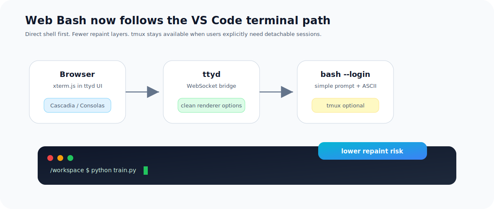
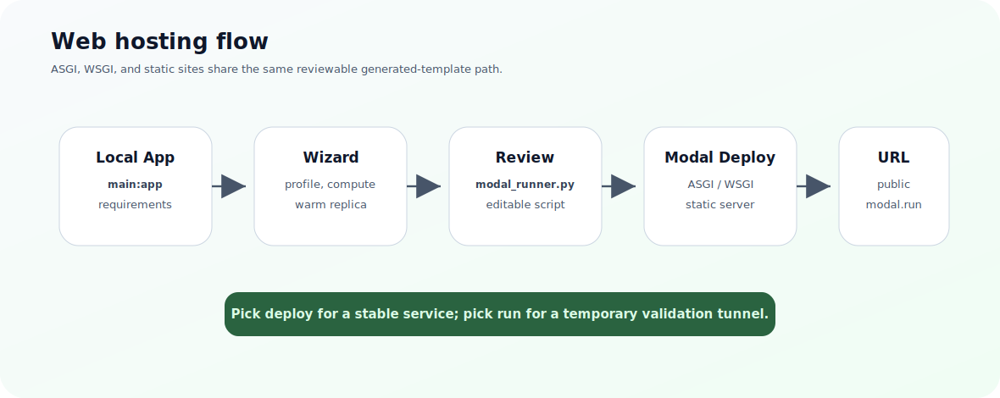
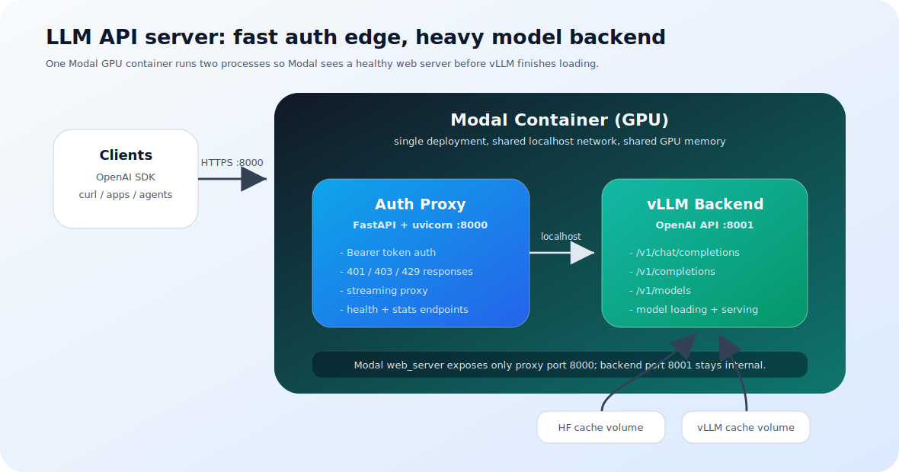

# Getting Started

This guide gets you from zero to running GPU workloads and hosted web apps on Modal in a few minutes.

## Prerequisites

| Requirement | Why |
|---|---|
| Python 3.10+ | Runtime for the CLI |
| Modal account | You need `token_id` and `token_secret` from [modal.com/settings](https://modal.com/settings) |
| `modal` CLI | Must be installed and available in PATH (`pip install modal`) |

## Install

### From PyPI

```bash
pip install m-gpux
```

### From source

```bash
git clone https://github.com/PuxHocDL/m-gpux.git
cd m-gpux
pip install -e .
```

Verify the install:

```bash
m-gpux --help
```

## Step 1: Add your first profile

```bash
m-gpux account add
```

You will be prompted for:

| Field | Description | Where to find it |
|---|---|---|
| **Profile name** | A label like `personal` or `work` | You choose this |
| **Token ID** | Modal API token ID | [modal.com/settings](https://modal.com/settings) -> API Tokens |
| **Token Secret** | Modal API token secret | Same page -> API Tokens, shown once at creation |

Profiles are stored in `~/.modal.toml`. You can add as many as you need.

## Step 2: Verify your profiles

```bash
m-gpux account list
```

You will see a table of all configured profiles, with the active one marked.

## Step 3: Launch a GPU session

```bash
m-gpux hub
```

<figure class="doc-figure" markdown="span">
  
  <figcaption>The browser terminal is intentionally close to VS Code's direct-shell model.</figcaption>
</figure>

The interactive hub walks you through:

1. Select a profile
2. Pick a GPU
3. Pick an action: Jupyter Lab, Run Python script, Web Bash shell, or vLLM inference
4. Review the generated `modal_runner.py`
5. Press Enter to launch, or edit the script first

!!! info "What happens under the hood"
    The hub generates a Modal deployment script (`modal_runner.py`) with your chosen GPU and action, then runs it with Modal. The script is fully editable, so you can add pip packages, change timeouts, or customize the container image before launch.

!!! tip "Smooth browser terminal"
    The Web Bash shell uses direct `bash` by default for smoother interaction and cleaner rendering. `tmux` is still installed; run `tmux` manually when you want detachable sessions.

## Step 4: Host your first web app

For a FastAPI app:

```bash
m-gpux host asgi --entry main:app
```

For a Flask app:

```bash
m-gpux host wsgi --entry app:app
```

For a static site:

```bash
m-gpux host static --dir ./site
```

<figure class="doc-figure" markdown="span">
  
  <figcaption>The host wizard turns a local ASGI, WSGI, or static app into a reviewable Modal deployment.</figcaption>
</figure>

The hosting wizard asks for:

1. Modal profile
2. App name
3. CPU or GPU compute
4. Dependencies or `requirements.txt`
5. Upload exclude patterns
6. Warm replica strategy
7. `deploy` vs `run`

!!! note "Recommended next read"
    The complete walkthrough is in [Web Hosting](web-hosting.md), including project layout examples, generated Modal decorators, and troubleshooting tips.

## Step 5: Check your costs

```bash
m-gpux billing usage --days 30 --all
```

This aggregates usage across all your configured profiles for the last 30 days.

To open the Modal billing dashboard in your browser:

```bash
m-gpux billing open
```

## Step 6: Deploy an LLM API

Turn any HuggingFace model into a production OpenAI-compatible API with authentication.

<figure class="doc-figure" markdown="span">
  
  <figcaption>The public endpoint is the auth proxy; vLLM stays behind it on localhost.</figcaption>
</figure>

### 1. Create an API key

```bash
m-gpux serve keys create --name my-key
```

This generates a `sk-mgpux-...` key and stores it in `~/.m-gpux/api_keys.json`.

### 2. Deploy with the interactive wizard

```bash
m-gpux serve deploy
```

The wizard guides you through model choice, GPU, context length, engine tuning, keep-warm behavior, and API key selection.

### 3. Test your endpoint

```bash
curl https://<workspace>--m-gpux-llm-api-serve.modal.run/health
```

### 4. Stop when done

```bash
m-gpux serve stop
m-gpux stop --all
```

## Typical daily workflow

```text
Morning
  m-gpux account switch work
  m-gpux hub
  ... train / experiment ...

Afternoon
  m-gpux host asgi --entry main:app
  m-gpux serve deploy

Evening
  m-gpux stop --all
  m-gpux billing usage --days 1 --all
```
